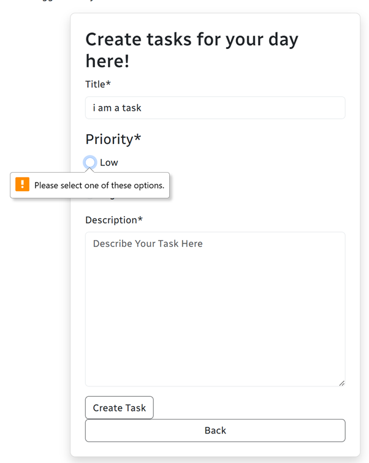

# Starplanner - Portfolio-Project-4

# Contents

* [What is MOTech](#what-is-MOTech)
    * [What-is-Starplanner?](#what-is-Starplanner)
    * [Why-use-Starplanner](#Why-use-Starplanner)
* [User Stories](#user-stories)
* [Existing Features](#existing-features)
    * [Future Implementations](#future-implementations)
    * [Technologies and Libraries Used](#technologies-languages-and-libraries-used-in-starplanner)
* [Data Model](#data-models)
* [Testing](#testing)
* [Deployment](#deployment-instructions)
    * [Clone The Repository](#github-clone)
    * [How To Create A Fork](#github-fork)
    * [Deployment to Heroku](#heroku-deployment)
* [Credits](#credits)
    * [Content](#credits)
    * [Media](#credits)

## What is MOTech?
MOTech or Motion Optimised Technology are a small, hypothetical 'start-up' IT Company who have asked me to create a Django based, Task Management System. They wanted the app to have some specifics. MOTech wanted to have individual user logins, The ability to switch planner views from all tasks to their individual user tasks. The ability to select task priority between low, medium and high. Minimalist in design and be easy to use.

This is where [Starplanner](https://starplanner-d7711dee4aa3.herokuapp.com/) was born.

## What is Starplanner?
Starplanner is a work management, planner app that allows users to Create, Read, Update and Delete their own tasks as well as being able to 'Read' tasks that fellow work colleagues are working on.

## Why use Starplanner?

The aim of Starplanner is to provide a task management system that all users of MOTech can individually and collectively work on.

## User Stories

For Starplanner, Agile principles were used to track and monitor the progress of the project. user stories were documented as issues on GitHub. Agile also included the use of GitHub's Kanban project board. Full kanban project board and User Stories can be found [here](https://github.com/users/BeeBeeBethC/projects/10). The MoSCoW technique used to prioritize tasks, features or requirements for a project split into four columns, Must-have, Should-have, Could-have and Won't-have more information on MoSCoW methodology can be found [here](https://www.techtarget.com/searchsoftwarequality/definition/MoSCoW-method).

## Existing Features

The Website includes the ability to register, login, logout, Create tasks, Read tasks, Update tasks and Delete tasks. (CRUD functionality) The website also adds comments automatically to track when tasks are created and updated. starplanner also has access restrictions, users must be registered to view tasks and can only update and delete their own.

original form design

actual form design is much more cleaner and minimalist compared to the original design.

The color contrast checker was used to ensure that whatever colors the author chose to use throughout starplanner, was significant contrast and ensure accessibility was of highest priority.

Inspiration for the color choices in Starplanner are a pastel version of IBM color blind safe palette as discussed in David Nichols - [coloring for colorblindness](https://davidmathlogic.com/colorblind/#%23D81B60-%231E88E5-%23FFC107-%23004D40) which talks about how everyone percieves color differently.

please note: some of the following screenshots were taken during the project and once deployed. 

## Future Implementations
future implementations: 

For starplanner, the author would like to implement an optional pomodoro technique which uses short time sprints more information on the pomodoro technique can be found [here](https://www.techtarget.com/whatis/definition/pomodoro-technique).

The author also wants to enable other companies to use it not just MOTech. This would include individual company portals. 

## Technologies, Languages and libraries used in Starplanner
* Html
* CSS
* Javascript
* Python 
* Django
* Gitpod/vscode - coding workspace/migrated to VSCode during project.
* Github - storage and commit history
* Heroku - hosting platform for Starplanner
* Replit - used to aid with debugging.
* Bootstrap - to aid with styling and keeping consistency throughout
* Crispy Forms - to aid with form styling and form validation
* DJlint - to help debug any django errors
* Eraser - to help me generate my ERD model.

## Data Models

The data model diagram above makes it easier to plan models for my website, included are users, tasks and comments models.

## Testing

Full testing documentation can be viewed in the [TESTING.md](https://github.com/BeeBeeBethC/Starplanner-PP4/blob/main/TESTING.md) file. 

## Deployment Instructions

Starplanner was deployed to both Github and Heroku.

The reason for deploying to Github as well as Heroku was to monitor version control and commits throughout the project as well as implement user stories and the use of Githubs Kanban board.

### Github Clone
To clone a copy of Starplanner from the Github repository, please follow these steps:

1. Go to the repository you wish to clone, project link is as follows. ([here](https://github.com/BeeBeeBethC/Starplanner-PP4))

2. Click on the green button that reads 'Code'.

3. On the dropdown menu, please select the 'Copy URL to clipboard' option this button looks like two squares overlaying one another.

4. Open your favourite code editor, for myself it is Visual Studio Code. on Visual Studio Code, click the 'source control' button from the left hand menu.

(Alternatively, open the terminal and change your working directory to the location of the cloned repository.)

5. Paste the repository URL into the top navigation bar of Visual Studio Code.

(Alternatively type 'git clone' into the terminal and paste the URL link.)

6. Save the repository to a localised folder where the repository will be stored on your computer.

7. Click on select repository location.

8. Let the repository download and click 'open' when the on screen prompt shows in the lower right corner of the screen.

### Github Fork

To fork the repository of Starplanner, please follow these steps.

1. Sign up or login to Github.

2. Go to the repository for Starplanner ([here](https://github.com/BeeBeeBethC/Starplanner-PP4))

3. Click the fork button on the top right hand side of the screen.

PLEASE NOTE: The steps followed above will provide the code only. To access the project from Heroku, please continue to follow the steps below.

### Heroku Deployment

The live link to Starplanner can be found [here](https://starplanner-d7711dee4aa3.herokuapp.com/)

To deploy to Heroku, please follow these steps:

1. Create your list of requirements by navigating to the requirements.txt file. each package is known as a dependency so therefore should be located in this file when uploading to heroku so that Heroku can still open projects.

2. To create your list of requirements, type in the gitpod (or code terminal of your choice) "pip3 freeze > requirements.txt" ensuring you have the exact same spelling, all lower case for the exact file name or this will not work.

3. Commit and push most recent code upto github.

4. If not done already, Sign-up or Login to Heroku.

5. Navigate to your Heroku dashboard.

6. From the Heroku dashboard, create a new app and name it. Each app name needs to be unique or it won't accept it.

7. Select region.

8. Make sure your settings have been set before you deploy.

9. If settings are not declared, here are the steps for checking settings before deployment.
    1. Find the config vars section. (these are environmental variables section found in heroku settings). In this tab "Reveal Config Vars" this is where you put sensitive information for example the Database_URL that can't be shown publicly.

    2. add heroku/python to your build pack options.

10. For this project there is the choice of automatic deployment or manual. For Starplanner the author has chosen to manually deploy it which means that it won't automatically update from pushed changes but it does show deployment logs along the way.

11. To manually update and re-deploy the project using the main branch:
    1.  Firstly make sure your most recent changes have been pushed to github and confirm these before moving onto the next step.
    
    2.  Navigate back to project overview and select the deploy option from the navigation menu at the top of the page.
    
    3.  Scroll down the deploy page until you reach manual deploy.
    
    4.  Choose branch to deploy, make sure it's the main branch.
    
    5.  Click the deploy button.

    6.  For this project, it was easier to monitor build logs by accessing them during project build.

## Credits
### Content

The guidance of Code Institutes walk through project I Think So I Blog was used for inspiration only and to get a better understanding of how to use and implement Django's Framework. source code can be found [here](https://github.com/Code-Institute-Solutions/blog/tree/main).

[Django Allauth](https://docs.allauth.org/en/latest/) was used for register, login and logout features.

[Django Crispy Forms](https://django-crispy-forms.readthedocs.io/en/latest/) was used for form styling enabling html validation.

[Django Documentation](https://www.djangoproject.com/) was relied on heavily throughout to ensure django functions where implemented fully and practically.

[Bootstrap](https://getbootstrap.com/docs/5.3/getting-started/introduction/) was used for styling as well as custom CSS for the banner and footer. bootstrap JavaScript was also used and implemented in this project for the permission modal.

[Net Ninja](https://www.youtube.com/playlist?list=PL4cUxeGkcC9iqfAag3a_BKEX1N43uJutw)'s playlist for a deeper understanding of Django.

[Net Ninja's Bootstrap playlist](https://www.youtube.com/playlist?list=PL4cUxeGkcC9joIM91nLzd_qaH_AimmdAR) for a better understanding of Bootstrap and how to implement it within existing projects. 

### Media
Screenshots used in this project are all authors own.

### Acknowledgements

I would like to say a huge thank you to my family and friends for the continual support.

Specifically family friend Simon for his knowledge and to offer advice for debugging purposes. 

I would like to say a huge Thank You to my awesome Mentor Luke Buchanan. for his guidance through out this project and previous projects completed.

I would like to send a shout out to Kera Cudmore who provides an excellent readme document that I continually to use for guidance for my own readme documents.

I also would like to thank all staff members at Code Institute specifically tutor Roman for helping me debug my html validation when I was in a bit of a whirlwind with project 4! 