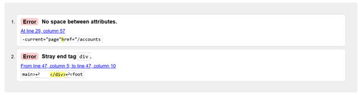
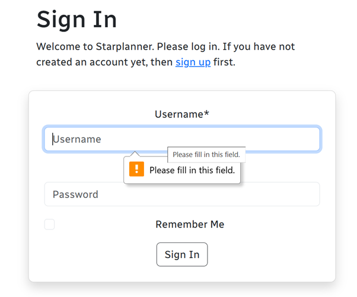
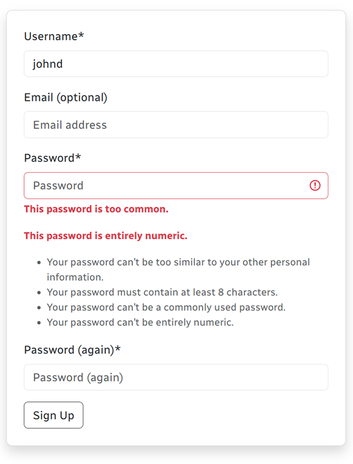
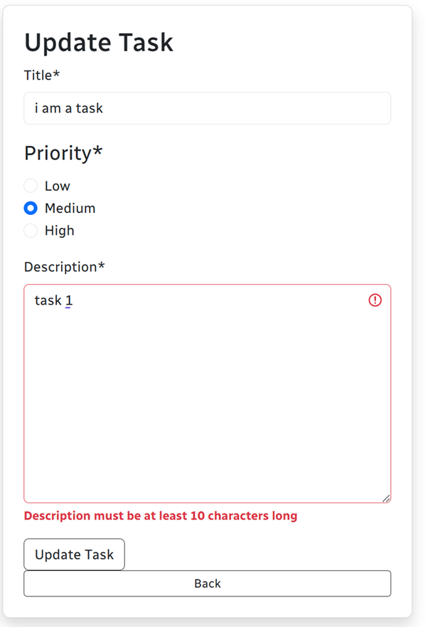
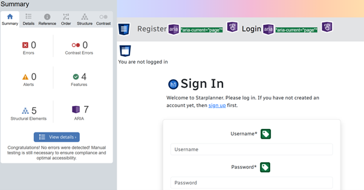

# Starplanner

This document has been produced due to the extensive testing conducted on this project.

# Contents
* [Full Website Testing](#manual-testing)
* [Automatic Website Testing](#automatic-testing)
* [Validator Testing](#validator-testing)
* [Debugging](#debugging)
    * [Known bugs](#known-bugs)
    * [Resolved Bugs](#resolved-bugs)
    * [Existing Bugs](#existing-bugs)
* [Further Testing](#further-testing)

## Manual Testing
Full Manual Testing performed. results as shown

| Website Feature | Expected Outcome | Testing Performed | Result | Pass or Fail |
| :-------: | :-------------: | :-------: | :-------: | :-------: |
| website displayed login status on homepage | the login status of the user is visible | opened the website | login status shown | Pass |
| burger icon on medium screens | navbar drops down | clicked on the burger icon | navbar dropped down | Pass |
| press 'Login' option on navbar when on medium plus screens | page displays status of being logged in or not, navbar drops down | clicked on login | navigated to page where login status was displayed | Pass |
| login | the sign in form shows up | clicked the login button | sign in form appeared | Pass |
| sign up from login page | the register page appears instead of login | clicked the sign up link | sign up form loaded | Pass |
| form validation | empty forms, passwords less than 8 characters and entirely numeric values throw up an error | input numbers 1-4 and 1-8 as well as passwords less than 8 characters threw errors | validation error occurred (see accompanying screenshots below) | Pass |
| sign in success message | a django message shows successfully signed in as 'username of person logged in' | signed into the website | success message showed up | Pass |
| selecting 'my tasts' as new user | new users will only have the option to create new tasks | clicked 'my tasks' | only create new task button showed up | Pass |
| selecting my tasks as an existing user | users have the option to access their tasks first | clicked 'my tasks' | tasks created by user showed up first | Pass |
| create task | used for task creation | clicked the 'create new task button' | create new task form showed up | Pass |
| create task form input validation | form field validation shows up if users haven't put in enough detail or skipped a field | put varying amounts of content into the create task form | validation showed up (see accompanying screenshots) | Pass |
| update task button and validation (as above) | update button gets clicked and form fields show validation is same as above | pressed the update button put various amounts of content in | update task form appeared validation shown as above | Pass |
| delete task | delete button is clicked verification shows 'do you want to delete this task?' | clicked the delete button | delete validation showed | Pass |
| clicked comments button | comments that are automatically input on creation and update | clicked the comments button | could see the comments that had been made | Pass |
| clicked on someone else's task buttons (update, delete and comment buttons) | modal should show stating that the user doesnt have access to modify the task | clicked the update, delete and comments button | modal appeared, access denied | Pass |
| priority shown | each priority category has a corresponding badge | clicked priority in create/update task modes | corresponding badge appeared (red, yellow and green badges) | Pass |
| page navigation buttons | each button changes what tasks display | clicked page buttons | tasks and numbers changed | Pass |
| pressed logout on navbar  | sign out page shows asking if you want to sign out | clicked logout nav link | Logout page appeared | Pass |
| pressed sign out button  | signs user out | clicked the sign out button | user signed out | Pass |
| as super user, users and coresponding tasks get removed from the task view | removes all tasks created from deleted user | deleted user as admin | user and corresponding tasks removed from website | Pass |
|  |  |  |  |  |

## Automatic Testing

The results shown in the above screenshots show the initial automatic testing by running "python manage.py test". These tests cover the 'CRUD' (create, read, update, delete) functionality.

## PEP8 validation

PEP8 validation using [CI Python Linter](https://pep8ci.herokuapp.com/) was conducted across the python files in the project, before and after screenshots were taken and have been included.

## JShint validation

comments to let JShint understand that the functions are called elsewhere in the project

## CSS Validation

## HTML Validation
Roman from Tutor support helped guide me through sections of the html validation.

please note: In the pictures below, picture 34 was used to represent the remaining validation as there was sensitive information on the other screenshots taken. All HTML files validated successfully. 

## Manual Form Validation

## Bugs

1. css styles not linking

favicon refusing to show

### Solved bugs

1. css styles not linking

Due to the file name not being recognised, on adjustement, file path worked.

2. favicon not showing or being recognised

### Remaining Bugs

No known remaining bugs are left in this project.

## Wave Testing

The above alert on wave testing is due to pagination links going to the same location however the author made an executive decision to keep the pagination links that were causing alerts for aesthetic reasons. No errors were found and when removed, they didn't look right.

the link above showing an alert is due to links going to the same place on the page as you can access these links either on the navbar or the page itself.

This is the permissions modal which appears when users that aren't associated with the corresponding task are trying to edit, delete or access comments for that task.

## Lighthouse Scores

Lighthouse scores for both desktop and mobile devices are as follows:

Desktop Lighthouse Scores

Mobile Lighthouse Scores

### Further Testing

Further testing was completed on:

* A Huawei Laptop
* Samsung Galaxy A22

As well as testing completed in browsers:

* Chrome 
* Microsoft Edge
* FireFox Web Browser

with no issues identified.

Thank you for viewing the TESTING.md document for Starplanner.